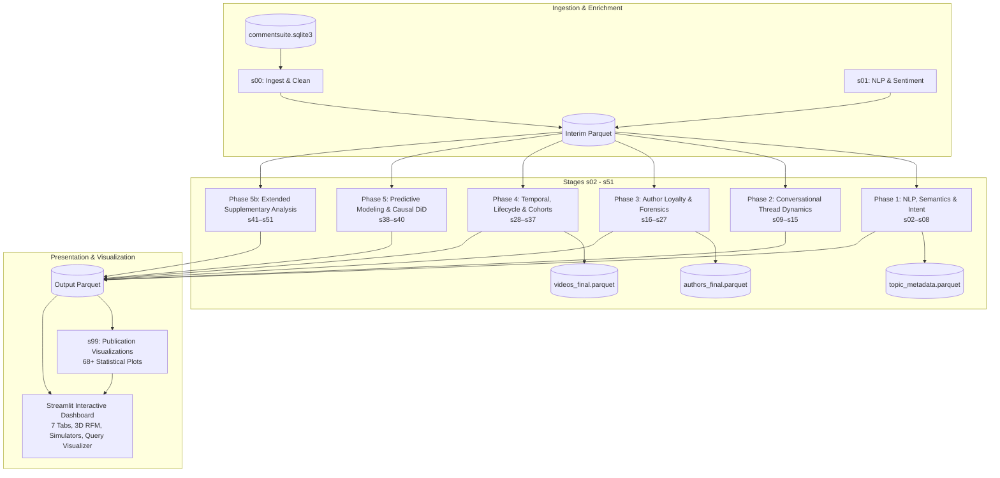

# 🧬 ytint — High-Dimensional YouTube Conversational Intelligence & Forensics Platform

`ytint` transforms raw YouTube comment exports into multi-dimensional forensic, topological, semantic, causal, and predictive intelligence.

---

## 🌟 Key Highlights

- **53 Discrete Analytical Layers**: Structured across 7 deterministic phases (NLP & Semantics, Conversational Thread Dynamics, Author Forensics, Longitudinal & Cohort Dynamics, Predictive & Causal Inference, Extended Supplementary Analysis, and Publication-Ready Visualizations).
- **1:1 Canonical Physical Script Mapping**: Every stage script in `src/pipeline/` matches its canonical ID (`s00_ingest.py` through `s51_topic_injection.py`, plus `s99_visualize.py`).
- **Modular Visualizations Engine**: 68+ publication-quality Matplotlib/Seaborn plot generators organized into `src/pipeline/visualizations/` (`nlp_plots.py`, `thread_plots.py`, `author_plots.py`, `temporal_plots.py`, `model_plots.py`, and `theme.py`).
- **Interactive Streamlit Intelligence Dashboard**: 7 comprehensive analytical tabs featuring dynamic Plotly visualizations, live parameter scanners, what-if virality simulators, 3D community spaces, human-readable video titles, and an interactive query sandbox.
- **Centralized Configuration**: All forensic heuristics, anomaly detection thresholds, and hyper-parameters are surfaced in [`config/settings.yaml`](file:///c:/Users/deadj/Sources/ytint/config/settings.yaml).
- **High-Performance Vectorized Storage**: Snappy-compressed Apache Parquet tables with Rust-accelerated token hashing and zero redundant compute.

---

## 🏗️ Architecture Overview



---

## 🚀 Quickstart & Execution

### 1. Environment Setup

```powershell
# Create and activate virtual environment with uv
uv python install 3.11
uv venv .venv --python 3.11
.\.venv\Scripts\Activate.ps1
uv pip install -e .
```

### 2. Ingest Data (Live YouTube API or Commentsuite SQLite)

```powershell
# Ingest live channel uploads directly from YouTube Data API v3:
.\.venv\Scripts\ytint-ingest.exe --handle '@channel_handle' --max-videos 10 --max-comments 1000

# Or simulate offline without an API key:
.\.venv\Scripts\ytint-ingest.exe --mock --handle '@test_demo'

# Or simply place your existing 'commentsuite.sqlite3' database in 'data/raw/'
```

### 3. Run the Intelligence Pipeline

```powershell
# Execute the full 53-stage end-to-end pipeline sweep
.\.venv\Scripts\python.exe -m pipeline.runner
# Or via registered console shortcut:
.\.venv\Scripts\ytint-runner.exe

# High-speed Incremental Delta Runner (processes only new/updated comments, skips in <1s if clean):
.\.venv\Scripts\ytint-runner.exe --incremental

# Audit changes between SQLite and interim Parquet:
.\.venv\Scripts\ytint-runner.exe --diff

# Run or rebuild from a specific stage
.\.venv\Scripts\python.exe -m pipeline.runner --from-stage s19
.\.venv\Scripts\python.exe -m pipeline.runner --stage s25
```

### 4. Launch the Interactive Dashboard

```powershell
# Start the Streamlit application
.\.venv\Scripts\python.exe -m streamlit run src/app.py
# Or via entrypoint:
.\.venv\Scripts\streamlit.exe run src/app.py
```

Open **[http://localhost:8501](http://localhost:8501)** to access the dashboard.

### 5. Generate Executive Intelligence Dossier

```powershell
# Generate standalone, offline-portable HTML briefing dossier (with print-to-PDF support):
.\.venv\Scripts\ytint-report.exe
# Or directly:
.\.venv\Scripts\python.exe -m engine.reporter
# Or automatically upon pipeline sweep:
.\.venv\Scripts\ytint-runner.exe --report
```

### 6. Generate AI Natural Language Briefings & RAG Q&A

```powershell
# Synthesize executive strategy briefing (Gemini REST / Ollama / OpenAI / Mock):
.\.venv\Scripts\ytint-ai.exe --summary

# Offline simulation without an API key:
.\.venv\Scripts\ytint-ai.exe --mock --summary

# Summarize controversy and debate camps for a comment thread:
.\.venv\Scripts\ytint-ai.exe --thread <ROOT_COMMENT_ID>

# Conversational RAG Q&A grounded across all 53 pipeline layers:
.\.venv\Scripts\ytint-ai.exe --ask "What is the ratio of loyalists to drive-by commenters?"
```

### 7. Export Interactive Network Graphs (GEXF & GraphML)

```powershell
# Export all 3 network graphs (Author Reply, Bipartite, Co-Commenting) in GEXF & GraphML:
.\.venv\Scripts\ytint-graph.exe

# Or automatically upon pipeline sweep:
.\.venv\Scripts\ytint-runner.exe --networks
```

### 8. Automated Anomaly & Threat Alerting (Webhooks)

```powershell
# Scan forensic & anomaly layers in dry-run mode (saved to data/output/alerts/latest_alert.json):
.\.venv\Scripts\ytint-alert.exe --dry-run

# Dispatch to Discord / Slack / Telegram webhooks:
.\.venv\Scripts\ytint-alert.exe --webhook-url "https://discord.com/api/webhooks/..." --severity WARNING

# Or automatically upon pipeline sweep:
.\.venv\Scripts\ytint-runner.exe --alert
```

### 9. Neural Semantic Vector Search & Feedback Clustering

```powershell
# Run sub-50ms vector similarity search with thematic feedback clustering:
.\.venv\Scripts\ytint-search.exe --query "audio quality issues microphone echo" --top-k 20 --clusters 4

# Multi-faceted filtering (loyalty tier, minimum likes, sentiment polarity):
.\.venv\Scripts\ytint-search.exe --query "video editing pacing" --tier "Loyalists" --min-likes 5 --sentiment-min 0.2

# Export results directly to CSV or JSON:
.\.venv\Scripts\ytint-search.exe --query "feature request roadmap" --export-format json --output search_results.json
```

### 10. Real-Time Chronological Event Replay & Crisis Simulation

```powershell
# Replay video comment arrivals in 30-minute frames and track crisis triggers:
.\.venv\Scripts\ytint-replay.exe --video-id WpbN3D5oQBo --step-mins 30

# Replay first 48 hours post-upload:
.\.venv\Scripts\ytint-replay.exe --video-id WpbN3D5oQBo --step-mins 60 --max-hours 48

# Fast mock simulation mode (testing & demonstrations):
.\.venv\Scripts\ytint-replay.exe --mock --step-mins 30 --max-hours 24 --export scratch/timeline.json
```

### 11. Creator Actionability & Engagement Optimization Assistant

```powershell
# Triage comments into high-leverage action queues with causal uplift projections:
.\.venv\Scripts\ytint-assist.exe --video-id WpbN3D5oQBo

# Filter for priority unanswered questions and draft AI replies:
.\.venv\Scripts\ytint-assist.exe --video-id WpbN3D5oQBo --action REPLY --draft-replies --tone clarifying
```

### 12. High-Speed Zero-Copy Analytical SQL Engine (DuckDB)

```powershell
# List all 95+ registered Parquet tables, row counts, and sizes:
.\.venv\Scripts\ytint-sql.exe --list-tables

# Describe table column schemas:
.\.venv\Scripts\ytint-sql.exe --describe authors

# Run an ad-hoc ANSI SQL query directly over Parquet files on disk:
.\.venv\Scripts\ytint-sql.exe "SELECT rfm_cohort, count(*) as cnt FROM authors GROUP BY 1 ORDER BY 2 DESC"

# Run a curated analytical preset (e.g., VIP champions, toxicity outbreaks, DiD causal lift):
.\.venv\Scripts\ytint-sql.exe --preset champions_rfm

# Launch interactive ANSI SQL REPL studio:
.\.venv\Scripts\ytint-sql.exe --interactive
```

### 13. Temporal Narrative Scene Reaction Forensics

```powershell
# List videos with timestamp reaction comments:
.\.venv\Scripts\ytint-narrative.exe --list-videos

# Analyze narrative scene reactions for a specific video:
.\.venv\Scripts\ytint-narrative.exe --video-id 6h547XdZYiQ --step-secs 30

# Inspect detected viewer confusion hotspots:
.\.venv\Scripts\ytint-narrative.exe --video-id 6h547XdZYiQ --hotspots

# Fast mock simulation mode:
.\.venv\Scripts\ytint-narrative.exe --mock --step-secs 20 --export scratch/mock_scenes.csv
```

### 14. Forensic Author Persona & Sockpuppet Fingerprinting

```powershell
# List all clustered sockpuppet and alternate account rings:
.\.venv\Scripts\ytint-fingerprint.exe --list-rings

# Filter by minimum comments and confidence score threshold:
.\.venv\Scripts\ytint-fingerprint.exe --min-comments 3 --min-score 80.0

# Inspect a specific author's stylometrics and circadian profile:
.\.venv\Scripts\ytint-fingerprint.exe --author-name "Zubenko"

# Fast mock demonstration mode:
.\.venv\Scripts\ytint-fingerprint.exe --mock --list-rings
```

---

## 📊 Dashboard Perspectives (7 Tabs)

1. **Executive Briefing**: High-level KPI scorecards, AI Executive Strategy Briefing generator, one-click Executive Dossier generator & PDF export, community loyalty summaries, and interactive video performance quadrant matrix. ($X$=Volume, $Y$=Sentiment, Size=Likes, Color=Gini).
2. **Temporal Dynamics & Flashpoints**: Dynamic Anomaly Sensitivity Scanner ($Z$-score $1.5\sigma$–$4.5\sigma$, rolling baseline window 3–30 days), zoom range-slider, second-by-second reaction trajectories, multi-video playback comparisons, and **Real-Time Chronological Event Replay & Crisis Simulator** (interactive frame scrubber, dual-axis velocity/sentiment/toxicity timeline, flame-war risk gauges, active crisis trigger alerts, and JSON/CSV export).
3. **NLP, Semantics & Demand Intent**: Dynamic topic resonance matrix with customizable axes, audience demand intent classification, Plutchik emotions, AI Flame-War & Debate Tree Summarizer, target stance drift across debate depth, multilingual code-switching lift, and **Narrative Scene Reaction & Timestamp Scrubbing Forensics** (video selector, scene resolution slider, dual-axis reaction taxonomy and confusion hotspot timeline, interactive playback scrubber, active scene spotlight card with verbatim quote montage, and 1-click JSON/CSV exports).
4. **Audience Loyalty & Forensic Diagnostics**: Interactive 3D RFM community space, Coordinated Inauthentic Behavior (CIB) astroturfing ring severity map, toxicity contagion ($R_0$), troll catalyst rankings, **Interactive Community Network & Gephi Topology Explorer** (2D force-directed layout, top-$K$ node filtering, Louvain community coloring, and 1-click GEXF/GraphML exports), and **Forensic Author Persona & Sockpuppet Fingerprinting** (stylometric feature radar bar charts, 24-hour diurnal posting clocks, pairwise scatter matrix, clustered ring ledger, and suspect pair matches).
5. **Predictive Modeling & Causal Interventions**: Quasi-experimental Difference-in-Differences (DiD) creator intervention lift chart, interactive "What-If" comment virality simulator with attribution waterfall breakdown, Tree SHAP feature attribution, Dunn's post-hoc matrix, and audience overlap heatmap.
6. **Publication-Ready Visual Analytics Gallery**: Comprehensive catalog of 68+ high-resolution statistical plots with analytical guides and strategic takeaways.
7. **Interactive Data Explorer & Export Hub**: Full corpus regex filtering, interactive query sandbox & dynamic visualizer, Live YouTube API Ingest console, "Ask ytint" conversational AI analyst, Automated Anomaly & Threat Alerting Console, Neural Semantic Vector Search & Feedback Clustering Console, Creator Actionability & Engagement Optimization Workbench, **Zero-Copy Analytical SQL Studio & Query Workbench** (DuckDB-powered out-of-core SQL engine, table schema browser, 8 analytical presets, live telemetry, and Plotly visual chart builder), and instant dataset export across all 53 layers.


---

## 🧪 Testing & Validation

```powershell
# Run the complete test suite
.\.venv\Scripts\python.exe -m pytest -v

# Run dashboard compatibility tests
.\.venv\Scripts\python.exe -m pytest tests/test_dashboard_compatibility.py -v

# Compile all source files
.\.venv\Scripts\python.exe -m compileall -q src tests verify.py
```

---

## 📚 Project Documentation

- **[pipeline.md](pipeline.md)**: Exhaustive reference for all 53 analytical stages, algorithms, mathematical models, and input/output schemas.
- **[dashboard_guide.md](dashboard_guide.md)**: User and developer guide for the 7 dashboard tabs, interactive Plotly visualizations, and query sandbox.
- **[code_analysis.md](code_analysis.md)**: Deep-dive architecture review, system design patterns, and engineering resolutions.
- **[gap_analysis.md](gap_analysis.md)**: Line-by-line feature audit and implementation matrix.
- **[install.md](install.md)**: Detailed environment installation and CUDA acceleration instructions.
