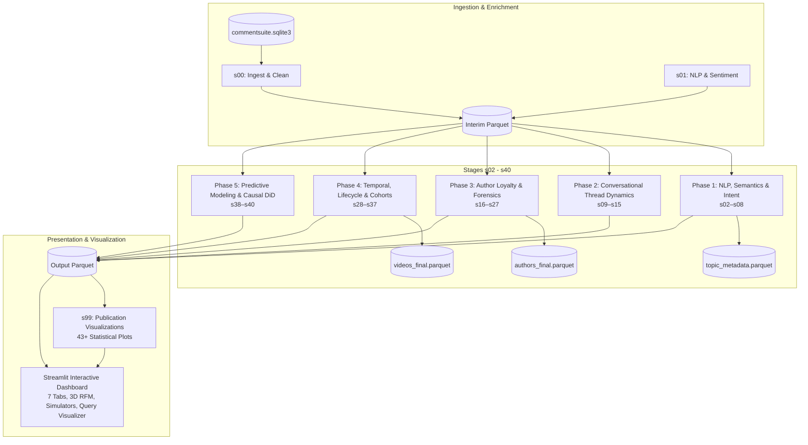

# 🧬 ytint — High-Dimensional YouTube Conversational Intelligence & Forensics Platform

`ytint` transforms raw YouTube comment exports into multi-dimensional forensic, topological, semantic, causal, and predictive intelligence.

---

## 🌟 Key Highlights

- **42 Discrete Analytical Layers**: Structured across 6 deterministic phases (NLP & Semantics, Conversational Thread Dynamics, Author Forensics, Longitudinal & Cohort Dynamics, Predictive & Causal Inference, and Publication-Ready Visualizations).
- **1:1 Canonical Physical Script Mapping**: Every stage script in `src/pipeline/` matches its canonical ID (`s00_ingest.py` through `s40_synthesis.py`, plus `s99_visualize.py`).
- **Modular Visualizations Engine**: 43+ publication-quality Matplotlib/Seaborn plot generators organized into `src/pipeline/visualizations/` (`nlp_plots.py`, `thread_plots.py`, `author_plots.py`, `temporal_plots.py`, `model_plots.py`, and `theme.py`).
- **Interactive Streamlit Intelligence Dashboard**: 7 comprehensive analytical tabs featuring dynamic Plotly visualizations, live parameter scanners, what-if virality simulators, 3D community spaces, human-readable video titles, and an interactive query sandbox.
- **Centralized Configuration**: All forensic heuristics, anomaly detection thresholds, and hyper-parameters are surfaced in [`config/settings.yaml`](file:///c:/Users/deadj/Sources/ytint/config/settings.yaml).
- **High-Performance Vectorized Storage**: Snappy-compressed Apache Parquet tables with Rust-accelerated token hashing and zero redundant compute.

---

## 🏗️ Architecture Overview



---

## 🚀 Quickstart & Execution

### 1. Environment Setup

```powershell
# Create and activate virtual environment with uv
uv python install 3.12
uv venv .venv --python 3.12
.\.venv\Scripts\Activate.ps1
uv pip install -r requirements.txt
```

### 2. Run the Intelligence Pipeline

```powershell
# Execute the full 42-stage end-to-end pipeline sweep
$env:PYTHONPATH = "src"
.\.venv\Scripts\python.exe -m pipeline.runner

# Run or rebuild from a specific stage
.\.venv\Scripts\python.exe -m pipeline.runner --from-stage s19
.\.venv\Scripts\python.exe -m pipeline.runner --stage s25
```

### 3. Launch the Interactive Dashboard

```powershell
# Start the Streamlit application
.\.venv\Scripts\python.exe -m streamlit run src/app.py
```

Open **[http://localhost:8501](http://localhost:8501)** to access the dashboard.

---

## 📊 Dashboard Perspectives (7 Tabs)

1. **Executive Briefing & Macro Intelligence**: High-level KPIs, top video performance leaderboard, and an interactive Plotly bubble quadrant matrix ($X$=Volume, $Y$=Sentiment, Size=Likes, Color=Gini).
2. **Temporal Dynamics & Flashpoints**: Dynamic Anomaly Sensitivity Scanner ($Z$-score $1.5\sigma$–$4.5\sigma$, rolling baseline window 3–30 days), zoom range-slider, second-by-second reaction trajectories, and multi-video playback comparisons.
3. **NLP, Semantics & Demand Intent**: Dynamic topic resonance matrix with customizable axes, audience demand intent classification, Plutchik emotions, target stance drift across debate depth, and multilingual code-switching lift.
4. **Audience Loyalty & Forensic Diagnostics**: Interactive 3D RFM community space, Coordinated Inauthentic Behavior (CIB) astroturfing ring severity map, toxicity contagion ($R_0$), and troll catalyst rankings.
5. **Predictive Modeling & Causal Interventions**: Quasi-experimental Difference-in-Differences (DiD) creator intervention lift chart, interactive "What-If" comment virality simulator with attribution waterfall breakdown, Tree SHAP feature attribution, Dunn's post-hoc matrix, and audience overlap heatmap.
6. **Publication-Ready Visual Analytics Gallery**: Comprehensive catalog of 43+ high-resolution statistical plots with analytical guides and strategic takeaways.
7. **Interactive Data Explorer & Export Hub**: Full corpus regex filtering, interactive query sandbox & dynamic visualizer (instant Bar, Histogram, Scatter, or Line charts), and instant CSV/Parquet dataset export across all 42 layers.

---

## 🧪 Testing & Validation

```powershell
# Run the complete test suite
.\.venv\Scripts\python.exe -m pytest -v

# Run dashboard compatibility tests
.\.venv\Scripts\python.exe -m pytest tests/test_dashboard_compatibility.py -v

# Compile all source files
.\.venv\Scripts\python.exe -m compileall -q src tests verify.py
```

---

## 📚 Project Documentation

- **[pipeline.md](pipeline.md)**: Exhaustive reference for all 42 analytical stages, algorithms, mathematical models, and input/output schemas.
- **[dashboard_guide.md](dashboard_guide.md)**: User and developer guide for the 7 dashboard tabs, interactive Plotly visualizations, and query sandbox.
- **[code_analysis.md](code_analysis.md)**: Deep-dive architecture review, system design patterns, and engineering resolutions.
- **[gap_analysis.md](gap_analysis.md)**: Line-by-line feature audit and implementation matrix.
- **[install.md](install.md)**: Detailed environment installation and CUDA acceleration instructions.
