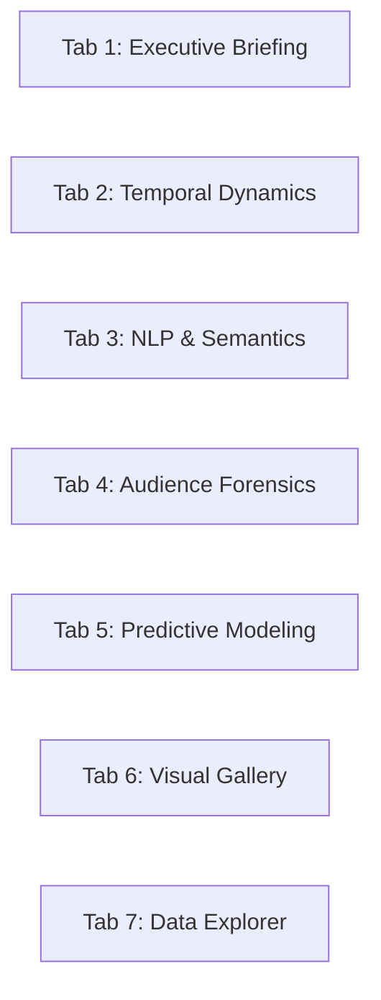

# 🧭 ytint Dashboard & Interactive Visual Analytics Guide

The **ytint Executive Intelligence Dashboard** is a high-dimensional, interactive Streamlit analytics platform built on top of 53 modular computational pipeline layers. It provides creators, data scientists, and community managers with forensic, topological, semantic, causal, and predictive insights.

---

## 🏛️ Application Architecture

- **Entrypoint**: [`src/app.py`](file:///c:/Users/deadj/Sources/ytint/src/app.py) is a thin, robust entrypoint that sets page configuration and invokes the modular UI application in [`src/ui/app.py`](file:///c:/Users/deadj/Sources/ytint/src/ui/app.py).
- **Styling & Theme**: Modern dark slate palette with centralized tokens in [`config/settings.yaml`](file:///c:/Users/deadj/Sources/ytint/config/settings.yaml) (`ui.palette`: `#0b0e14` canvas, `#11151c` sidebar, `#171d26` card surface, `#0066fe` Bloomberg primary blue) and Plotly `plotly_dark` themes with custom accents (`#00e599` emerald success, `#ff3366` ruby alert, `#00f0ff` cyber cyan, `#a855f7` purple).
- **Zero-Deprecation Compliance**: Strict usage of standard Streamlit APIs (`st.container(border=True)`, `width="stretch"` on dataframes and plotly charts).
- **Human-Readable Video Title Resolution**: Automatically extracts and maps official video titles from `videos_clean.parquet` across all table views, dropdown selectors, scatter tooltips, and matrix axes.

---

## 📑 Comprehensive Tab-by-Tab Reference



### Tab 1: Executive Briefing & Macro Intelligence

- **Platform KPI Cards**: Immediate metrics for Total Comments Captured, Unique Commenting Authors, Videos Analyzed, and Average Community Sentiment.
- **🤖 AI Executive Strategy Briefing (src/engine/synthesizer.py)**:
  - Natural language strategic assessment synthesizing DiD causal lift, Tree SHAP attributions, $R_0$ toxicity contagion, audience Pareto loyalists, and CIB clusters.
  - Multi-provider support: Google Gemini (REST), local offline Ollama (`http://localhost:11434`), OpenAI-compatible endpoints, or deterministic offline mock mode.
  - Generates channel health verdicts, loyalty topology assessments, forensic threat audits, and creator action playbooks.
- **📄 Executive Intelligence Dossier Generator**:
  - One-click compilation of a self-contained, offline-ready HTML dossier synthesizing all 53 analytical stages.
  - Generates comprehensive forensic threat matrices, audience Pareto structures, topic demand intent taxonomies, video controversy radars, and embedded high-resolution publication plots.
  - Interactive in-dashboard live preview expander (`components.html`) and direct download button (`ytint_executive_brief_<date>.html`).
  - Print-optimized CSS (`@media print`) enabling 1-click **Save as PDF** from any browser.
- **Strategic Key Findings Banner**: Automated highlights summarizing multilingual engagement lift, creator intervention multipliers, and top predictive drivers.
- **Video Performance Intelligence Leaderboard**: Interactive table sorting videos by volume, total likes, sentiment, Gini inequality, attention half-life, and revival spikes. Official `Video Title` is displayed as the primary column.
- **🎯 Dynamic Video Performance Quadrant Matrix**:
  - Interactive Plotly bubble scatter ($X$=Total Comments, $Y$=Average Sentiment Score, Size=Total Upvotes, Color=Gini Inequality).
  - Hover tooltips display the clean video title, comment volume, and sentiment score.
  - Dashed crosshair lines show the median volume and mean sentiment across the channel corpus.

---

### Tab 2: Temporal Dynamics & Conversational Flashpoints

- **⚡ Dynamic Anomaly Sensitivity Scanner**:
  - **Sensitivity Threshold Slider ($\sigma$)**: Real-time slider (1.5$\sigma$ to 4.5$\sigma$, default 2.5$\sigma$) to dynamically recalculate and mark viral event flashpoints.
  - **Rolling Baseline Window Slider**: Real-time slider (3 to 30 days, default 7 days) adjusting the moving average and standard deviation baseline.
  - **Timeline Interpolation Selector**: Switch between smooth cubic `spline` or discrete `linear` volume rendering.
  - **Plotly Range-Slider**: Interactive bottom zoom bar for granular inspection of specific historical spikes.
- **🎬 Video Reaction Dynamics (Second-by-Second)**:
  - Video selector dropdown formatted with human-readable titles: `Title (video_id)`.
  - Line plot tracking second-by-second sentiment and toxicity trajectory across video playback timestamps.
- **📊 Comparative Multi-Video Playback Dynamics**:
  - Multiselect widget enabling comparison of 2 to 5 videos simultaneously.
  - Switchable trajectory metric (VADER Sentiment vs. Detoxify Toxicity Level).
- **Spike & Poisson Burst Ledgers**: Side-by-side data tables for detected sudden anomaly spikes and high-frequency Poisson bursts.
- **⏱️ Real-Time Chronological Event Replay & Crisis Simulator (Section 2.5 / src/engine/event_replay.py)**:
  - **Video Selector & Configuration**: Choose any uploaded video with total comment counts, configure temporal resolution (15m, 30m, 60m, 120m buckets), and set the simulation horizon (up to 168 hours post-upload).
  - **Live Scorecard KPIs**: Total Replayed Comments, Peak Arrival Velocity (with timestamp and surge multiplier), Min Rolling Sentiment, and Crisis Flashpoint triggers count.
  - **Dual-Axis Interactive Plotly Timeline**: Dual-axis visualization combining Arrival Velocity bar chart, smoothed Rolling Sentiment curve, Rolling Toxicity curve, and Flame-War Risk index with vertical dashed alert lines for automated crisis triggers.
  - **Interactive Time Scrubber & Frame Inspector**: Granular slider scrubbing through discrete simulation timeframes. Displays current frame metrics (arrival volume, velocity acceleration, sentiment, toxicity, reply ratio, and flame-war risk score badge).
  - **Real-Time Active Window Feed**: Shows the top exemplar comments arriving at the selected scrubber timestamp, with author badges, upvote counts, sentiment scores, and toxicity levels.
  - **Detected Crisis Flashpoint Ledger**: Expandable table listing all detected crisis events (`VELOCITY_SURGE`, `TOXICITY_OUTBREAK`, `SENTIMENT_CRASH`, `FLAME_WAR_OUTBREAK`, `VIRAL_CASCADE`) with exact timestamps, descriptions, and trigger values.
  - **1-Click Export Hub**: Download complete chronicle records directly as structured JSON or CSV.

---

### Tab 3: Conversational Topic Modeling & Audience Demand Intent

- **🎯 Dynamic Topic Resonance & Engagement Explorer**:
  - Custom axis selectors: $X$-axis (Discussion Volume vs. Total Likes), $Y$-axis (Approval Rate vs. Max Likes), and color theme dimension.
  - Interactive bubble scatter mapping topic volume against community approval.
- **🎯 Audience Demand & Content Intent Mining (Stage 06 / Stage 35)**:
  - Donut chart breaking down comments into Praise, General Commentary, Feature/Content Requests, Technical Questions, Bug Reports, and Criticism.
- **Plutchik Emotion Wheel & Linguistic Profiling**: Plutchik emotion category counts, sentiment ridge plots, and reading grade distributions.
- **Multilingual Code-Switching Lift**: Bar chart quantifying the engagement upvote premium for Cyrillic/Latin code-switched comments.
- **Target-Specific Stance Detection & Polarization Drift (Stage 07 / Stage 39)**:
  - Line chart tracing ideological divergence (`favor_pct` vs `against_pct`) across reply tree debate depth.
  - Video target stance breakdown table and high-conflict polarized thread ledger.
- **⚖️ AI Flame-War & Debate Tree Summarizer**:
  - Automatically reconstructs threaded discussions from root comments down the entire reply tree.
  - Extracts the core controversy trigger, segments participants into opposing factions (Camp A vs Camp B), traces toxicity and emotional escalation dynamics, and recommends specific creator mediation actions.
- **⏱️ Narrative Scene Reaction & Timestamp Scrubbing Forensics (Section 3.10 / src/engine/narrative.py)**:
  - **Video Selector & Resolution Configuration**: Choose any uploaded video and adjust the scene bin resolution slider (10s to 60s buckets) with live timestamp reaction counts.
  - **Summary Metric Cards**: Live scorecards for Total Video Runtime, Timestamp Reactions, Scene Clusters, Confusion Hotspots, and Peak Scene Moment.
  - **Viewer Confusion Hotspots Callout Banner**: Proactively highlights timestamps where audience questions and confusion cluster, recommending creator intervention (e.g. pinned comment, chapter marker, or video description clarification).
  - **Dual-Axis Interactive Plotly Timeline**: Combines a reaction density bar chart colored by dominant reaction taxonomy (`humor_laughter` amber, `shock_surprise` crimson, `emotional_touching` emerald, `critique_analytical` royal blue, `chapter_navigation` purple, `general_reaction` slate) with confusion hotspot triangle badges and a smoothed rolling VADER sentiment trajectory.
  - **Interactive Scene Scrubber & Quote Montage**: Scrub smoothly through playback time to inspect the active scene spotlight card and verbatim quotes from viewers at that exact moment.
  - **1-Click Export Hub**: Download complete narrative forensics reports as structured JSON or scene clusters CSV.

---

### Tab 4: Audience Segmentation, Loyalty & Forensic Diagnostics

- **🕵️ Coordinated Inauthentic Behavior (CIB) Rings (Stage 25 / Stage 36)**:
  - Identified CIB rings table and synchronized comment pairings.
  - **Synchronized Comments Ledger**: Includes resolved `Video Title` column.
  - **🕸️ CIB Ring Severity Map**: Interactive scatter plot mapping ring size against total synchronized event volume and average synchronization interval ($\Delta t$).
- **🔥 Toxicity Contagion & Troll Catalyst Instigators (Stage 15 / Stage 37)**:
  - Four key metrics: Toxic Comment Share, Toxicity Reproduction Number ($R_0$), Avg Replies to Toxic Root vs Neutral Root.
  - Provocation tier spectrum donut chart (Low Spark, Moderate Catalyst, Severe Flame Instigator).
  - Ranked troll catalysts table ($C = \text{Toxicity} \times \text{Replies Sparked}$).
- **🌐 Interactive 3D RFM Community Space**:
  - Fully rotatable 3D Plotly scatter plot (Recency vs. Activity Frequency vs. Total Upvotes Received).
  - Points color-coded by behavioral RFM cohort (Champions, Loyalists, Potential, At-Risk, Hibernating).
  - Camera coordinates preset with clean default perspective (`x=1.5, y=1.5, z=1.2`).
- **RFM Author Segmentation Ledger**: Ranked table of top commenters.
- **🌐 Interactive Community Network & Gephi Topology Explorer (Section 4.6 / src/engine/network_exporter.py)**:
  - **Graph Topology Selector**: Switch between Author Reply Network (Directed who-replies-to-whom), Author-Video Bipartite Network (Multi-modal content engagement), and Author Co-Commenting Network (Shared video community co-occurrence).
  - **Dynamic Top-$K$ Node Filter Slider**: Interactive filter (25 to 250 nodes, default 75) to isolate high-influence subgraphs and prevent WebGL canvas overcrowding.
  - **Color Dimension Selector**: Colorize nodes dynamically by Louvain Community Cluster (`community_id`), PageRank Authority (`pagerank`), Reply Activity (`in_degree`), or Inauthentic Bot Suspect Flag (`is_bot_suspect`).
  - **2D Force-Directed Spring Layout**: High-performance Plotly WebGL scatter graph with node sizing proportional to PageRank centrality, rich HTML hover tooltips (Community cluster, In/Out degree, RFM Loyalty Tier, Bot status), and active connection links.
  - **1-Click Topology Exporters**: Direct browser download buttons for `.gexf` (Gephi) and `.graphml` (Cytoscape / yEd) network files pre-computed with full structural attributes.
- **🕵️ Forensic Author Persona & Sockpuppet Fingerprinting (Section 4.7 / src/engine/fingerprint.py)**:
  - **Threshold Sliders & Controls**: Adjust Minimum Comment Threshold (2 to 10) and Sockpuppet Confidence Threshold (60% to 95%) with live profile recalculation or demo/mock mode.
  - **Live Forensic Scorecards**: Profiled Authors, Evaluated Pairs, Suspect Sockpuppet Pairs, Clustered Sockpuppet Rings, and Largest Ring Size.
  - **Pairwise Forensic Scatter Plot**: Dual-axis scatter plotting Stylometric Cosine Similarity (Shannon entropy, punctuation intensity, capitalization ratio) vs. 24-Hour Circadian Diurnal Similarity, colored by composite probability score and sized by shared video counts.
  - **Clustered Sockpuppet Rings Ledger**: Lists detected multi-account rings with confidence score, peak active UTC hour, dominant RFM cohort, and member accounts.
  - **Suspect Pair Matches Ledger**: Granular side-by-side comparison of author pairs with individual metric similarities (Style, Diurnal, Target Jaccard).
  - **Author Persona & Stylometric Dossier Inspector**: Dropdown author selector with live Shannon entropy, punctuation intensity, caps ratio, top emojis, and dual interactive charts:
    - **24-Hour Diurnal Posting Clock (UTC)**: Bar chart showing circadian posting hours and peak activity window.
    - **Stylometric Feature Fingerprint**: Bar chart mapping normalized values across 10 forensic dimensions.
    - **Verbatim Quote Feed**: Representative comments authored by the suspect account.
  - **1-Click Export Hub**: Download complete forensic reports as structured JSON or suspect sockpuppet pairs as CSV.

---

### Tab 5: Cross-Video Relations, Counterfactuals & Modeling

- **📈 Creator Interaction Causal Uplift (Stage 39)**:
  - Metric delta cards displaying treated mean, control mean, and percentage lift.
  - **📊 DiD Counterfactual Cohort Bar Chart**: Grouped bar chart comparing Treated threads (early creator engagement within 2h) vs Control threads across Reply Count, Upvotes, Sentiment, and Lifespan.
  - High-impact creator intervention threads table with `Video Title`.
- **⚡ Interactive Comment Virality & Upvote Simulator**:
  - Live parameter sliders: Comment Word Count (2–120), Emoji Count (0–8), Arrival Speed post-upload (1–720 min), Sentiment Polarity ($-1.0$ to $+1.0$), Contains Question toggle, Creator Engagement toggle.
  - **Live Metric Output**: Instant calculated upvote yield with creator lift delta.
  - **Attribution Waterfall Breakdown**: Bar chart illustrating exact points contributed by Base Text, Early Arrival Speed, Tone/Emojis, Question Factor, and Creator Lift.
- **📊 Dunn's Post-Hoc Pairwise $p$-Value Matrix**:
  - Non-parametric Kruskal-Wallis post-hoc significance heatmap.
  - Formatted with human-readable video titles along both axes.
- **🌐 Cross-Video Commenter Overlap Matrix**:
  - Jaccard similarity heatmap formatted with human-readable video titles.
- **Tree SHAP Attribution & 30-Day Forward Forecast**: Feature importance rankings and Prophet/ARIMA daily volume projection with confidence intervals.
- **🌐 Multi-Channel & Playlist Competitive Intelligence Engine (Section 5.6 / src/engine/comparator.py)**:
  - **Cross-Channel & Cohort Target Switcher**: Toggle between Multi-Channel Comparison, Quarterly Release Cohorts (e.g., 2026Q1 vs 2026Q2 vs 2026Q3), and Synthetic Benchmark Demo.
  - **Executive KPI Strip**: Total Profiled Cohorts, Evaluated Pairwise Overlaps, Shared Commenter Population, Max Jaccard Overlap %, and Average Toxicity Reproduction Rate ($R_0$).
  - **🎯 Normalized Radar Benchmark Matrix**: Interactive Plotly polar radar chart (`go.Scatterpolar`) comparing entities across 6 normalized dimensions: Discussion Volume, Engagement Velocity, Sentiment Positivity, Community Safety, Audience Loyalty, and Lexical Sophistication.
  - **📋 Comprehensive Performance Ledger**: Tabular comparison of total videos, comments, unique authors, comments/video, likes/comment, reply ratio, positive/negative sentiment %, VADER polarity, mean toxicity, and vocabulary Shannon entropy.
  - **👥 Audience Overlap & Commenter Migration Map**: Pairwise selector showing Jaccard similarity and Overlap Coefficient. Dynamic Plotly scatter/bubble map of shared commenters plotting sentiment in Channel A vs Channel B (points above the diagonal show positive sentiment migration; points below show negative shift).
  - **📝 Shared Commenter Migration Ledger**: Identifies high-activity cross-channel commenters, comment volumes across channels, and net sentiment shifts.
  - **💾 1-Click Multi-Format Export**: Direct download buttons for complete report JSON and benchmark profiles CSV.

---

### Tab 6: Publication-Ready Visual Analytics Gallery

- **68+ High-Resolution Statistical Plots**:
  - Section 1: Temporal Dynamics & Lifecycle Modeling (Kaplan-Meier survival, Poisson bursts, STL decomposition, diurnal heatmaps).
  - Section 2: NLP, Semantics & Emotion Spectrum (UMAP embeddings, Plutchik wheel, named entities, word co-occurrence, toxicity heatmaps).
  - Section 3: Audience Networks, Segmentation & Forensics (Author network, bot heuristics, like inflation, Lorenz curve, Pareto).
  - Section 4: Cross-Video Topology, Cohorts & Predictive Modeling (SHAP summary, topic streamgraph, cohort retention, video profile radar).
- **Expandable Analytical Guides**: Every visualization card features an interactive expander with **Methodology & Model**, **How to Read**, and **Strategic Takeaway**.

---

### Tab 7: Interactive Data Explorer & Export Hub

- **🔍 Interactive Comment & Corpus Explorer**:
  - Live full-text search / regex filter.
  - Upvote floor slider and toxicity ceiling slider.
  - Data table displays `Video Title` alongside `comment_id`, `author_display_name`, `like_count`, and `text`.
- **⚡ Interactive Query Sandbox & Dynamic Visualizer**:
  - Layer selector to load any of the 53 pipeline datasets.
  - Optional Pandas/SQL query filter (e.g., `like_count > 10 and is_bot_suspect == True`).
  - Customizable Chart Type: **Bar Chart**, **Histogram**, **Scatter Plot**, or **Line Chart**.
  - Dropdown selectors for $X$-Axis Field, $Y$-Axis Field (Numeric), and Color Grouping Field.
- **📥 Export Intelligence Datasets**:
  - One-click CSV and Parquet downloads for all 53 generated pipeline artifacts.
- **📑 Executive Dossier & Intelligence Briefing Exporter**:
  - Direct UI export for the complete multi-layer executive briefing dossier with optional plot embedding toggle.
- **🔌 Live YouTube Data API Ingest Connector**:
  - Interactive direct API ingest console to fetch channel uploads by handle (`@creator`), channel ID (`UC...`), or single video ID.
  - Granular limits for maximum uploads and comments per video to protect API quotas.
  - Built-in **Mock Mode** for offline simulation and automated testing.
  - Automatic Parquet materialization and SQLite upsert into `commentsuite.sqlite3`.
- **⚡ Pipeline Synchronization // Incremental Delta Runner**:
  - Real-time delta inspector between source SQLite (`commentsuite.sqlite3`) and interim Parquet artifacts.
  - Displays live badges for pending new comments, modified upvote/reply counters, and pending new videos.
  - One-click **"⚡ Run Incremental Pipeline Sweep"** button that non-destructively upserts new rows in `s00`, runs NLP inference strictly on missing comments in `s01`, and updates downstream analytical artifacts in seconds.
- **💬 Ask ytint // AI Conversational Analyst (RAG)**:
  - Natural language Q&A interface grounded across all 53 pipeline metric layers.
  - Ask ad-hoc questions about channel dynamics, Pareto retention curves, bot infection rates, top audience intents, or optimal video posting strategies.
  - Grounded responses citing exact numerical evidence from the computed pipeline artifacts.
- **🚨 Automated Anomaly & Threat Alerting Console (Section 7.5 / src/engine/alerting.py)**:
  - Automated scanner continuously inspecting 7 forensic and viral dimensions (CIB astroturfing rings, creator impersonation, viral volume spikes, negative sentiment shocks, toxicity outbreaks, troll sparks, like inflation, topic injection).
  - Real-time Threat Status scorecards (Overall Status, Critical Threats, Warnings, Total Active Anomalies).
  - Active Threat Digest Ledger detailing severity, triggered threat dimensions, forensic metrics, and recommended creator interventions.
  - Interactive Webhook Notification Dispatcher supporting Discord embeds, Slack Block Kit, Telegram HTML, or generic JSON endpoints.
  - Built-in Dry-Run / Preview mode and live payload inspector before remote dispatch.
- **🔍 Neural Semantic Vector Search & Feedback Clustering (Section 7.6 / src/engine/semantic_search.py)**:
  - Sub-50ms neural similarity search across 340,027 root comments using precomputed 384-dimensional SentenceTransformer embeddings (`topic_embeddings.npy`).
  - Natural language concept searching (sound distortion, future video ideas, editing pacing feedback, constructive criticism).
  - Multi-dimensional filters: Author Loyalty Tier (`Champions`, `Loyalists`, `Regular`, `Casual`, `Drive-by`), Minimum Upvotes, and Video ID.
  - Thematic Feedback Clustering: Groups retrieved comments into distinct thematic clusters with c-TF-IDF keyword tags, average sentiment, comment counts, and representative exemplar quotes.
  - Direct 1-click downloads for search results in `.csv` and `.json`.
- **🎯 Creator Actionability & Engagement Optimization Workbench (Section 7.7 / src/engine/assistant.py)**:
  - Automated triage engine scanning comments to prioritize high-leverage creator actions:
    - **📌 Pin Candidates**: High-signal, constructive commentary that sets an exemplary discussion tone.
    - **❤️ Heart Candidates**: Rapid positive reinforcement for VIP Champions and Loyalists to cement retention.
    - **💬 Reply / Question Triage**: High-priority unanswered questions, bug reports, and content requests.
    - **🛡️ De-escalation Sparks**: Tense or polarized debate threads where early creator intervention yields maximal causal toxicity suppression.
  - **Empirical Causal Uplift Estimates**: Integrates Stage 39 DiD causal inference parameters (`+320% thread expansion`, `+0.28 sentiment lift`, `-45% toxicity suppression`, `+3.8x like amplification`).
  - **AI Context-Aware Reply Drafter**: 1-click generation of suggested responses tailored to commenter loyalty cohort in four distinct creator voices (`Warm & Grateful`, `Clarifying & Factual`, `Empathetic & De-escalating`, `Playful`).
  - **Direct Triage Export**: 1-click downloads for the complete prioritized action queue in `.csv` and `.json`.
- **⚡ Zero-Copy Analytical SQL Studio & Query Workbench (Section 7.8 / src/engine/sql_engine.py)**:
  - **Out-of-Core DuckDB Engine**: Instant sub-10ms ANSI SQL queries directly over all **95+ analytical Parquet tables** without database server setup or in-memory DataFrame copying.
  - **🗂️ Interactive Schema Browser**: Live catalog view of all Parquet tables, file sizes, row counts, and column types (`DESCRIBE SELECT * FROM <table>`).
  - **💡 8 Curated Analytical Presets**: 1-click SQL templates including VIP RFM Champions, Toxicity Outbreaks, DiD Causal Lift, CIB Coordinated Rings, Topical Valence Drift, Video Engagement Benchmarks, Bot Repetition Audits, and Sentiment Attention Economy.
  - **⏱️ Live Query Telemetry**: Millisecond execution timing badge, row count returns, and memory safety monitors.
  - **📊 Dynamic Visual Chart Builder**: Interactive Plotly visualizer rendering Bar Charts, Line Charts, Scatter Plots, or Histograms dynamically from query results with customizable X/Y metric axes.
  - **💾 1-Click Multi-Format Export**: Direct download buttons for CSV and JSON result sets.

---

## 🛠️ Configuration & Customization

All pipeline thresholds, forensic heuristics, and UI tokens are centralized in [`config/settings.yaml`](file:///c:/Users/deadj/Sources/ytint/config/settings.yaml):

```yaml
# === Narrative & Change-Points ===
stage_28_narrative:
  change_point_penalty: "auto"
  z_threshold: 2.5

# === Forensic Detection & Integrity ===
stage_26_integrity:
  lsh_threshold: 0.8           # MinHash Jaccard similarity for spam clusters
  lsh_num_perm: 128            # Number of MinHash permutation hashes
  burst_window_minutes: 5      # Rolling time-series bin size (minutes)
  burst_multiplier: 10.0       # Volume multiplier over median for brigading bursts

stage_20_frequency_tiers:
  casual_max: 5                # Upper bound for Casual tier (2-5 comments)
  regular_max: 20              # Upper bound for Regular tier (6-20 comments)
  superfan_max: 100            # Upper bound for Super-Fan tier (21-100 comments)

stage_24_bot_heuristics:
  tier1_min_comments: 10       # Minimum volume for Tier 1 spam duplicate check
  tier1_max_unique_ratio: 0.2  # Max unique token ratio to classify as duplicate spammer
  tier2_min_comments: 50       # High-volume Tier 2 duplicate check
  tier2_max_unique_ratio: 0.5  # Max unique token ratio for high-volume accounts
  reused_name_min_comments: 5  # Cutoff for accounts with duplicate display names
  reused_name_max_unique: 0.3  # Max unique ratio for accounts with duplicate display names

stage_21_driveby_loyalists:
  driveby_max_videos: 1        # Max videos for Drive-by tier
  casual_max_videos: 3         # Max videos for Casual tier (2-3 videos)

stage_27_like_inflation:
  min_like_count: 5            # Minimum likes required to evaluate like inflation
  inflation_quantile: 0.99     # Quantile threshold for anomalous like-to-reply ratios
  min_inflation_ratio: 20.0    # Floor threshold for likes-per-reply ratio
  bot_inflation_ratio: 10.0    # Lower threshold when author is a suspected bot

stage_23_impersonation:
  min_name_length: 6           # Min display name length to avoid false positives
  min_unique_accounts: 2       # Min distinct channel IDs sharing the same display name

stage_25_cib:
  time_window_seconds: 120     # Max temporal delta (seconds) for synchronized comments
  min_cooccurrences: 2         # Min synchronized events across videos for CIB ring

stage_15_toxicity:
  toxicity_threshold: 0.5      # Min toxicity score to classify comment as toxic
  catalyst_min_toxic: 2        # Min toxic comments to qualify as Troll Catalyst
  catalyst_min_score: 10.0     # Min catalyst impact score for high instigator tier

stage_36_arrival_speed:
  first_responder_days: 1      # Threshold for First Responder tier
  on_time_days: 7              # Threshold for On-Time tier
  late_arrival_days: 30        # Threshold for Late Arrival boundary
  arrival_curve_minutes: 120   # Time window for minute-level arrival velocity curve

# === Causal & Predictive Modeling ===
stage_39_creator_uplift:
  early_window_minutes: 120    # Minutes since upload defining early creator intervention

stage_38_modeling:
  xgboost_n_estimators: 100
  xgboost_learning_rate: 0.1
  xgboost_max_depth: 5
  train_test_split: 0.8
  shap_max_samples: 1000
  forecast_periods: 30

# === UI Palette & Styling ===
ui:
  palette:
    background: "#0b0e14"      # Deep Kibana dark canvas
    sidebar: "#11151c"         # Slate navigation tone
    surface: "#171d26"         # Metric card surface
    grid: "#283243"            # Subtle border line for card grids
    text: "#e2e8f0"            # Off-white text readability
    primary: "#0066fe"         # Bloomberg operational blue
    accent: "#00f0ff"          # Cyber cyan highlight tracking
    sentiment_pos: "#00ff66"   # Viridian positive metric accent
    sentiment_neg: "#ff3366"   # Crimson negative metric accent
```

