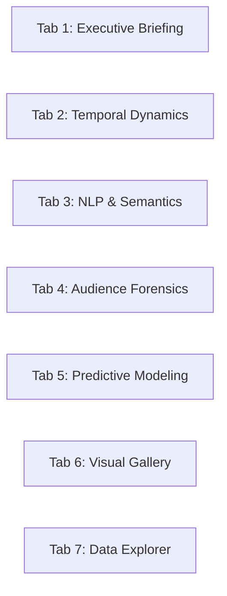

# 🧭 ytint Dashboard & Interactive Visual Analytics Guide

The **ytint Executive Intelligence Dashboard** is a high-dimensional, interactive Streamlit analytics platform built on top of 42 modular computational pipeline layers. It provides creators, data scientists, and community managers with forensic, topological, semantic, causal, and predictive insights.

---

## 🏛️ Application Architecture

- **Entrypoint**: [`src/app.py`](file:///c:/Users/deadj/Sources/ytint/src/app.py) is a thin, robust entrypoint that sets page configuration and invokes the modular UI application in [`src/ui/app.py`](file:///c:/Users/deadj/Sources/ytint/src/ui/app.py).
- **Styling & Theme**: Dark slate palette (`#0f1117` background, `#1a1f2c` card containers, `#0066fe` primary cyan-blue, `#00e599` emerald success, `#ff3366` ruby alert) with modern Plotly `plotly_dark` themes.
- **Zero-Deprecation Compliance**: Strict usage of standard Streamlit APIs (`st.container(border=True)`, `width="stretch"` on dataframes and plotly charts).
- **Human-Readable Video Title Resolution**: Automatically extracts and maps official video titles from `videos_clean.parquet` across all table views, dropdown selectors, scatter tooltips, and matrix axes.

---

## 📑 Comprehensive Tab-by-Tab Reference



### Tab 1: Executive Briefing & Macro Intelligence

- **Platform KPI Cards**: Immediate metrics for Total Comments Captured, Unique Commenting Authors, Videos Analyzed, and Average Community Sentiment.
- **Strategic Key Findings Banner**: Automated highlights summarizing multilingual engagement lift, creator intervention multipliers, and top predictive drivers.
- **Video Performance Intelligence Leaderboard**: Interactive table sorting videos by volume, total likes, sentiment, Gini inequality, attention half-life, and revival spikes. Official `Video Title` is displayed as the primary column.
- **🎯 Dynamic Video Performance Quadrant Matrix**:
  - Interactive Plotly bubble scatter ($X$=Total Comments, $Y$=Average Sentiment Score, Size=Total Upvotes, Color=Gini Inequality).
  - Hover tooltips display the clean video title, comment volume, and sentiment score.
  - Dashed crosshair lines show the median volume and mean sentiment across the channel corpus.

---

### Tab 2: Temporal Dynamics & Conversational Flashpoints

- **⚡ Dynamic Anomaly Sensitivity Scanner**:
  - **Sensitivity Threshold Slider ($\sigma$)**: Real-time slider (1.5$\sigma$ to 4.5$\sigma$, default 2.5$\sigma$) to dynamically recalculate and mark viral event flashpoints.
  - **Rolling Baseline Window Slider**: Real-time slider (3 to 30 days, default 7 days) adjusting the moving average and standard deviation baseline.
  - **Timeline Interpolation Selector**: Switch between smooth cubic `spline` or discrete `linear` volume rendering.
  - **Plotly Range-Slider**: Interactive bottom zoom bar for granular inspection of specific historical spikes.
- **🎬 Video Reaction Dynamics (Second-by-Second)**:
  - Video selector dropdown formatted with human-readable titles: `Title (video_id)`.
  - Line plot tracking second-by-second sentiment and toxicity trajectory across video playback timestamps.
- **📊 Comparative Multi-Video Playback Dynamics**:
  - Multiselect widget enabling comparison of 2 to 5 videos simultaneously.
  - Switchable trajectory metric (VADER Sentiment vs. Detoxify Toxicity Level).
- **Spike & Poisson Burst Ledgers**: Side-by-side data tables for detected sudden anomaly spikes and high-frequency Poisson bursts.

---

### Tab 3: Conversational Topic Modeling & Audience Demand Intent

- **🎯 Dynamic Topic Resonance & Engagement Explorer**:
  - Custom axis selectors: $X$-axis (Discussion Volume vs. Total Likes), $Y$-axis (Approval Rate vs. Max Likes), and color theme dimension.
  - Interactive bubble scatter mapping topic volume against community approval.
- **🎯 Audience Demand & Content Intent Mining (Stage 06 / Stage 35)**:
  - Donut chart breaking down comments into Praise, General Commentary, Feature/Content Requests, Technical Questions, Bug Reports, and Criticism.
- **Plutchik Emotion Wheel & Linguistic Profiling**: Plutchik emotion category counts, sentiment ridge plots, and reading grade distributions.
- **Multilingual Code-Switching Lift**: Bar chart quantifying the engagement upvote premium for Cyrillic/Latin code-switched comments.
- **Target-Specific Stance Detection & Polarization Drift (Stage 07 / Stage 39)**:
  - Line chart tracing ideological divergence (`favor_pct` vs `against_pct`) across reply tree debate depth.
  - Video target stance breakdown table and high-conflict polarized thread ledger.

---

### Tab 4: Audience Segmentation, Loyalty & Forensic Diagnostics

- **🕵️ Coordinated Inauthentic Behavior (CIB) Rings (Stage 25 / Stage 36)**:
  - Identified CIB rings table and synchronized comment pairings.
  - **Synchronized Comments Ledger**: Includes resolved `Video Title` column.
  - **🕸️ CIB Ring Severity Map**: Interactive scatter plot mapping ring size against total synchronized event volume and average synchronization interval ($\Delta t$).
- **🔥 Toxicity Contagion & Troll Catalyst Instigators (Stage 15 / Stage 37)**:
  - Four key metrics: Toxic Comment Share, Toxicity Reproduction Number ($R_0$), Avg Replies to Toxic Root vs Neutral Root.
  - Provocation tier spectrum donut chart (Low Spark, Moderate Catalyst, Severe Flame Instigator).
  - Ranked troll catalysts table ($C = \text{Toxicity} \times \text{Replies Sparked}$).
- **🌐 Interactive 3D RFM Community Space**:
  - Fully rotatable 3D Plotly scatter plot (Recency vs. Activity Frequency vs. Total Upvotes Received).
  - Points color-coded by behavioral RFM cohort (Champions, Loyalists, Potential, At-Risk, Hibernating).
  - Camera coordinates preset with clean default perspective (`x=1.5, y=1.5, z=1.2`).
- **RFM Author Segmentation Ledger**: Ranked table of top commenters.

---

### Tab 5: Cross-Video Relations, Counterfactuals & Modeling

- **📈 Creator Interaction Causal Uplift (Stage 39)**:
  - Metric delta cards displaying treated mean, control mean, and percentage lift.
  - **📊 DiD Counterfactual Cohort Bar Chart**: Grouped bar chart comparing Treated threads (early creator engagement within 2h) vs Control threads across Reply Count, Upvotes, Sentiment, and Lifespan.
  - High-impact creator intervention threads table with `Video Title`.
- **⚡ Interactive Comment Virality & Upvote Simulator**:
  - Live parameter sliders: Comment Word Count (2–120), Emoji Count (0–8), Arrival Speed post-upload (1–720 min), Sentiment Polarity ($-1.0$ to $+1.0$), Contains Question toggle, Creator Engagement toggle.
  - **Live Metric Output**: Instant calculated upvote yield with creator lift delta.
  - **Attribution Waterfall Breakdown**: Bar chart illustrating exact points contributed by Base Text, Early Arrival Speed, Tone/Emojis, Question Factor, and Creator Lift.
- **📊 Dunn's Post-Hoc Pairwise $p$-Value Matrix**:
  - Non-parametric Kruskal-Wallis post-hoc significance heatmap.
  - Formatted with human-readable video titles along both axes.
- **🌐 Cross-Video Commenter Overlap Matrix**:
  - Jaccard similarity heatmap formatted with human-readable video titles.
- **Tree SHAP Attribution & 30-Day Forward Forecast**: Feature importance rankings and Prophet/ARIMA daily volume projection with confidence intervals.

---

### Tab 6: Publication-Ready Visual Analytics Gallery

- **43+ High-Resolution Statistical Plots**:
  - Section 1: Temporal Dynamics & Lifecycle Modeling (Kaplan-Meier survival, Poisson bursts, STL decomposition, diurnal heatmaps).
  - Section 2: NLP, Semantics & Emotion Spectrum (UMAP embeddings, Plutchik wheel, named entities, word co-occurrence, toxicity heatmaps).
  - Section 3: Audience Networks, Segmentation & Forensics (Author network, bot heuristics, like inflation, Lorenz curve, Pareto).
  - Section 4: Cross-Video Topology, Cohorts & Predictive Modeling (SHAP summary, topic streamgraph, cohort retention, video profile radar).
- **Expandable Analytical Guides**: Every visualization card features an interactive expander with **Methodology & Model**, **How to Read**, and **Strategic Takeaway**.

---

### Tab 7: Interactive Data Explorer & Export Hub

- **🔍 Interactive Comment & Corpus Explorer**:
  - Live full-text search / regex filter.
  - Upvote floor slider and toxicity ceiling slider.
  - Data table displays `Video Title` alongside `comment_id`, `author_display_name`, `like_count`, and `text`.
- **⚡ Interactive Query Sandbox & Dynamic Visualizer**:
  - Layer selector to load any of the 42 pipeline datasets.
  - Optional Pandas/SQL query filter (e.g., `like_count > 10 and is_bot_suspect == True`).
  - Customizable Chart Type: **Bar Chart**, **Histogram**, **Scatter Plot**, or **Line Chart**.
  - Dropdown selectors for $X$-Axis Field, $Y$-Axis Field (Numeric), and Color Grouping Field.
- **📥 Export Intelligence Datasets**:
  - One-click CSV and Parquet downloads for all 42 generated pipeline artifacts.

---

## 🛠️ Configuration & Customization

All thresholds and heuristics can be customized in [`config/settings.yaml`](file:///c:/Users/deadj/Sources/ytint/config/settings.yaml):

```yaml
stage_28_narrative:
  z_threshold: 2.5
  rolling_window_days: 7

stage_25_cib:
  time_window_seconds: 120
  min_co_occurrences: 3

stage_27_like_inflation:
  like_to_reply_ratio_threshold: 20.0
  min_likes_threshold: 100

stage_24_bot_heuristics:
  repetition_similarity_threshold: 0.85
  temporal_burst_seconds: 30

stage_39_creator_uplift:
  early_window_hours: 2.0
```
